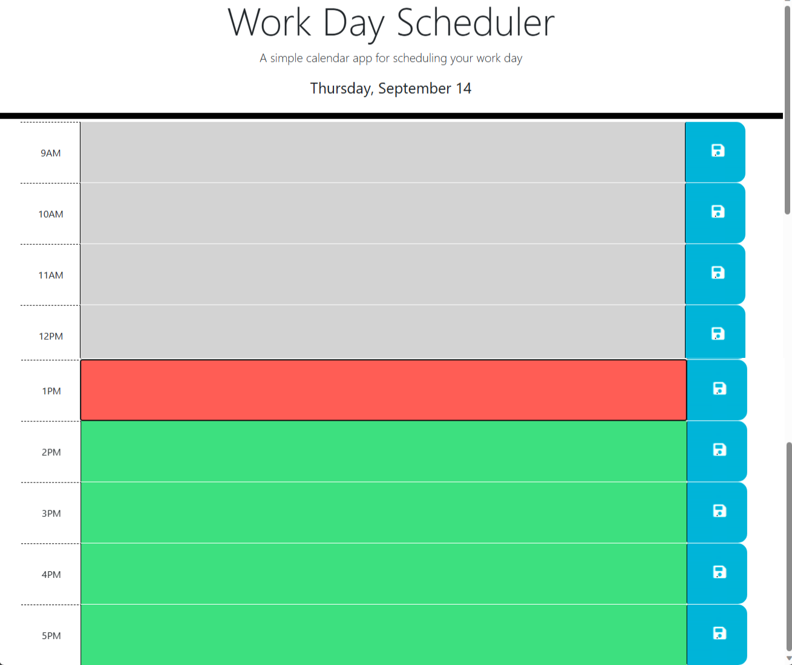

# Work Day Scheduler

This is a simple calendar app for scheduling your work day. It allows you to create and save events for each hour of the day.

## Getting Started

[Click this link](https://acantu9.github.io/work-day-scheduler/) to get started!

## Features

The app has the following features:

* Create and save events for each hour of the day
* View events for the current day
* Edit and delete events
* Save events to local storage

## Credits

The following resources were used in creating this project:  
[BlackboxAI](https://www.useblackbox.ai)  
[Xpert Learning Assistant](https://bootcampspot.instructure.com/courses/4010/external_tools/313)  
[Module 5 Challenge Review](https://zoom.us/rec/play/e6X7acyuwg1OiKxogCrR9wyVoOvbKH4rvLWFCU2JstYQbB0cg7q7XFmWjyJEWNXgouuegfFX2c_vg8dT.-Swlbkw03cwVU_Ev)

## License

Please refer to the LICENSE in the repo.
